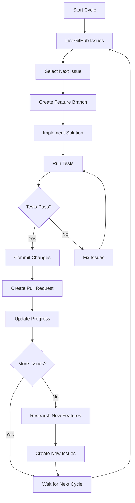

# 🤖 Auto-Claude: Autonomous Development System

**Fully autonomous AI-driven development for the Spacepunk Logistics Simulation game**

Auto-Claude is a sophisticated system that enables Claude AI to work autonomously on software development tasks for weeks at a time, complete with GitHub integration, comprehensive testing, and robust safety measures.

## 🎯 Purpose & Vision

Auto-Claude was designed to solve the problem of **continuous development during extended periods** (vacations, long-term projects) while maintaining **code quality** and **system stability**. It transforms Claude from a conversational assistant into an autonomous software engineer.

### Core Capabilities
- **Autonomous GitHub Workflow**: Pick issues → Create branches → Implement → Test → Create PRs
- **Week-Long Operation**: Designed to run unattended for 7+ days 
- **Safety-First Architecture**: Sandboxed execution with multiple fail-safes
- **Comprehensive Testing**: Built-in validation and health monitoring
- **Real-Time Monitoring**: Detailed logging and progress tracking

## 🏗️ System Architecture

### Components Overview

```
Auto-Claude System
├── 🐳 Docker Sandbox Environment
│   ├── Ubuntu 18 base with Node.js
│   ├── Pre-installed tools (git, gh, claude, sqlite3)
│   ├── Isolated filesystem with mounted project
│   └── Resource limits (2GB RAM, 1 CPU)
├── 🔄 Autonomous Scripts  
│   ├── production-auto-claude.sh (main orchestrator)
│   ├── resilient-auto-claude.sh (macOS native)
│   └── sandbox-auto-claude.sh (launcher)
├── 🧪 Testing Framework
│   ├── test-client.js (comprehensive API testing)
│   ├── Health monitoring & validation
│   └── Activity detection systems
├── 📊 Monitoring & Logging
│   ├── Multi-level logging (INFO/WARN/ERROR/SUCCESS)
│   ├── Progress tracking (JSON format)
│   └── Real-time activity detection
└── 🛡️ Safety Systems
    ├── Kill switches (file-based + signal)
    ├── Resource monitoring
    ├── Failure detection & recovery
    └── Emergency stop mechanisms
```

## 🚀 Quick Start

### Prerequisites
- Docker Desktop installed and running
- GitHub CLI authenticated (`gh auth login`)
- Claude CLI installed and authenticated
- Node.js and npm installed
- Access to spacepunk-logi repository

### Basic Usage

1. **Clone and Setup**
   ```bash
   git clone <spacepunk-repo>
   cd spacepunk-logi
   ```

2. **Test Run (15 minutes)**
   ```bash
   ./sandbox-auto-claude.sh test
   ```

3. **Production Run (1 week)**
   ```bash
   ./sandbox-auto-claude.sh production
   ```

4. **Monitor Progress**
   ```bash
   tail -f auto-claude-logs/auto-claude-*.log
   docker-compose -f docker-compose.auto-claude.yml logs -f
   ```

5. **Emergency Stop**
   ```bash
   touch STOP_AUTO_CLAUDE
   # or
   docker-compose -f docker-compose.auto-claude.yml down
   ```

## 🔧 Configuration Options

### Environment Variables
```bash
GITHUB_TOKEN=ghp_xxx...     # GitHub API access
NODE_ENV=development        # Development mode
DEBUG=true                  # Verbose logging (optional)
```

### Script Parameters
```bash
# Test mode: 5-minute cycles, max 3 cycles
./production-auto-claude.sh test

# Production mode: 30-minute cycles, ~672 cycles (1 week)
./production-auto-claude.sh
```

### Docker Configuration
Edit `docker-compose.auto-claude.yml` for:
- **Resource Limits**: Memory, CPU constraints
- **Volume Mounts**: Project files, output directories
- **Network Settings**: Isolation levels
- **Security Options**: User permissions, filesystem access

## 📋 Operational Workflow

### Autonomous Development Cycle



### Issue Prioritization Strategy

1. **Database/Infrastructure** (#53, #52, #49, #36, #31)
   - Core schema and table creation
   - Foundation systems

2. **Game Mechanics** (#54, #55, #56, #35, #32)
   - Trait systems, market simulation
   - Core gameplay features

3. **Advanced Features** (#68, #67, #59)
   - Political systems, LLM integration
   - Complex narrative systems

4. **Polish & Enhancement**
   - UI improvements, performance optimization
   - Bug fixes and refinements

## 🧪 Testing & Validation

### Built-in Test Suite (`test-client.js`)

**Comprehensive API Testing**
- HTTP endpoint validation via curl
- Database consistency checks
- WebSocket real-time monitoring
- Integration test scenarios

**Usage Examples**
```bash
node test-client.js health      # Quick health check
node test-client.js full        # Complete test suite
node test-client.js validate    # Database validation only
```

### Activity Detection

The system monitors multiple signals to verify Claude is actively developing:

- **Git Activity**: Recent commits, branch creation
- **File Modifications**: Source code changes
- **API Responses**: Successful HTTP requests
- **Database Changes**: Schema/data updates

### Health Monitoring

- **Resource Usage**: CPU, memory, disk space
- **Process Status**: Container health, script execution
- **Network Connectivity**: GitHub API, external services
- **Error Rates**: Failed operations, timeout frequency

## 📊 Logging & Monitoring

### Log Levels & Types

```bash
[INFO]    - Normal operational messages
[WARN]    - Potentially problematic conditions  
[ERROR]   - Failure conditions requiring attention
[SUCCESS] - Successful completion of major tasks
```

### Log Files

- `auto-claude-YYYYMMDD-HHMMSS.log` - Main execution log
- `claude-output-YYYYMMDD-HHMMSS.log` - Claude's output capture
- `progress-YYYYMMDD-HHMMSS.json` - Machine-readable progress
- `test-results.log` - Testing framework results

### Progress Tracking

JSON format progress file updated every cycle:
```json
{
  "session_id": "20250707-230559",
  "current_cycle": 5,
  "max_cycles": 672,
  "status": "working",
  "details": "Claude is actively developing",
  "last_update": "2025-07-07T23:30:00Z",
  "runtime_hours": 2.5
}
```

## 🛡️ Safety & Security

### Sandboxing Strategy

**Docker Isolation**
- Separate container with limited resources
- Read-only project mount (except git)
- Non-root user execution
- Network isolation options

**Resource Constraints**
- 2GB RAM limit (prevents memory runaway)
- 1 CPU core limit (prevents system overload)
- Disk space monitoring
- Process count limits

### Fail-Safe Mechanisms

**Multiple Kill Switches**
1. `STOP_AUTO_CLAUDE` file detection
2. Signal handling (CTRL+C, SIGTERM)
3. Docker container stop
4. Process timeout limits

**Error Recovery**
- Automatic restart on crashes
- Graceful degradation on failures
- State preservation between restarts
- Detailed error reporting

**Activity Validation**
- Real work detection (not just log spam)
- Progress validation every cycle
- Health check integration
- Stale session detection

## 🔍 Troubleshooting

### Common Issues

**Container Won't Start**
```bash
# Check Docker status
docker info

# View container logs
docker-compose -f docker-compose.auto-claude.yml logs auto-claude

# Verify file permissions
ls -la auto-claude-*
```

**Claude CLI Authentication**
```bash
# Login to container
docker exec -it spacepunk-auto-claude bash

# Re-authenticate Claude
claude auth login

# Test authentication
claude --help
```

**GitHub Integration Issues**
```bash
# Check GitHub token
echo $GITHUB_TOKEN

# Test GitHub CLI
gh auth status
gh issue list
```

**Performance Issues**
```bash
# Check resource usage
docker stats spacepunk-auto-claude

# Increase limits in docker-compose.yml
mem_limit: 4g
cpus: '2.0'
```

### Debug Mode

Enable verbose logging:
```bash
export DEBUG=true
./sandbox-auto-claude.sh test
```

## 📈 Expected Results

### After 24 Hours
- **3-5 GitHub issues** resolved with full implementations
- **Multiple pull requests** created and ready for review
- **Comprehensive test coverage** maintained
- **Clean commit history** with descriptive messages

### After 1 Week
- **20-30 GitHub issues** completed
- **Significant feature implementations** (trait system, market mechanics)
- **Database schema enhancements** (new tables, relationships)
- **UI improvements** (brutalist components, progressive unlocking)
- **Enhanced game mechanics** (crew management, trading systems)

### Quality Metrics
- **Test Pass Rate**: >95% of automated tests passing
- **Code Quality**: Consistent with existing patterns
- **Documentation**: Updated README and inline comments
- **Git Hygiene**: Atomic commits, clear branch names

## 🔮 Future Enhancements

### Planned Features
- **Multi-Repository Support**: Work across multiple projects
- **Advanced Testing**: Integration with CI/CD pipelines
- **Smart Prioritization**: AI-driven issue selection
- **Performance Optimization**: Faster cycle times
- **Collaboration Mode**: Multiple Auto-Claude instances

### Experimental Features
- **Code Review Integration**: Automatic PR reviews
- **Deployment Automation**: Staging environment updates
- **Bug Detection**: Proactive issue identification
- **Documentation Generation**: Automatic README updates

## 🤝 Contributing

### Development Setup
```bash
git clone <repo>
cd spacepunk-logi
npm install
./sandbox-auto-claude.sh test
```

### Adding New Features
1. Create feature branch
2. Update relevant scripts
3. Add comprehensive tests
4. Update documentation
5. Test in sandbox environment

### Reporting Issues
- Use GitHub issues for bug reports
- Include log files and system info
- Provide reproduction steps
- Tag with `auto-claude` label

## 📄 License & Credits

**License**: MIT License  
**Created for**: Spacepunk Logistics Simulation  
**Author**: AI Autonomous Development Team  
**Version**: 2.0.0

### Acknowledgments
- Claude AI for the autonomous development capabilities
- Docker for containerization and isolation
- GitHub CLI for seamless repository integration
- The Spacepunk development community

---

**Auto-Claude: Because great software shouldn't wait for you to get back from vacation.** 🏖️ → 🚀